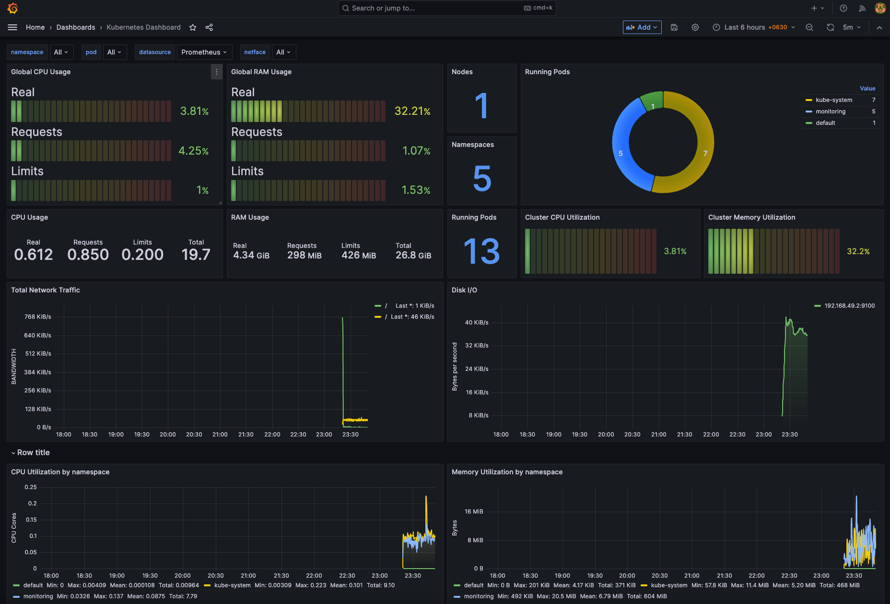
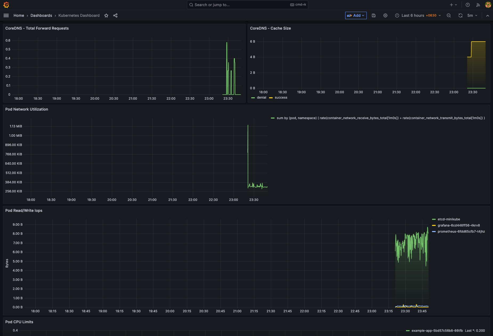
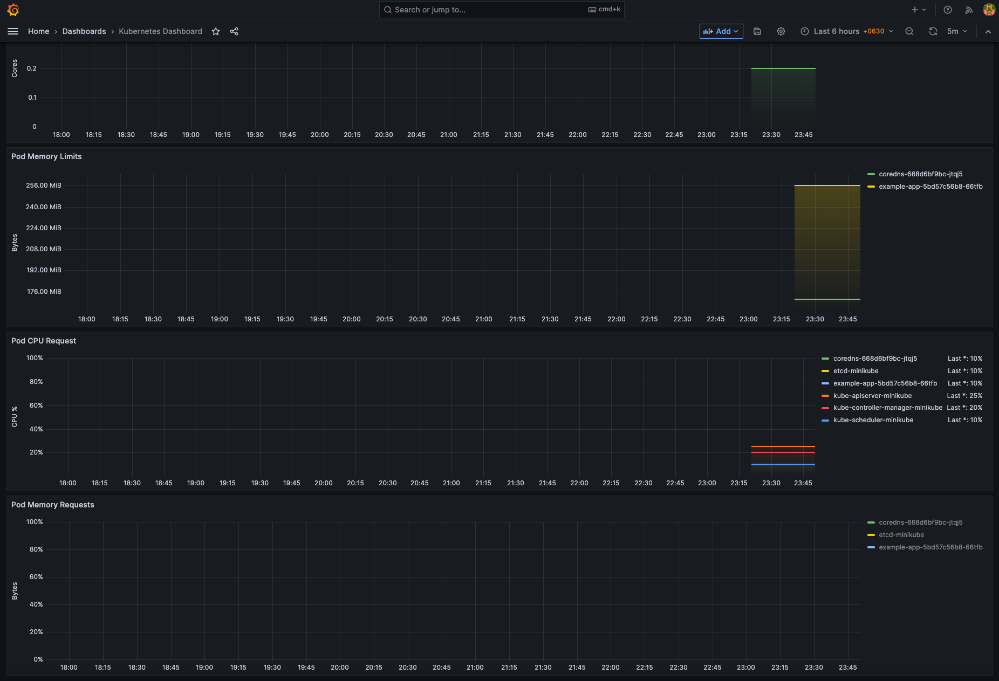

# Kubernetes Monitoring Stack

This repository provides a fully declarative, self-hosted Kubernetes monitoring stack using Kustomize for deployment. It covers Prometheus, Grafana (with persistent dashboards and datasources), kube-state-metrics, cAdvisor, and supporting ConfigMaps.

## Features

- **Declarative**: All resources (including dashboards and datasources) are defined in YAML and managed via Kustomize.
- **Auto-provisioned Grafana Dashboards**: Dashboards are loaded from ConfigMaps at startup, so your custom visualizations persist across restarts.
- **Persistent Prometheus Datasources**: Grafana datasources are automatically provisioned and survive pod restarts or cluster recreation.
- **No manual post-deployment steps**: All configuration is handled via Kubernetes manifests.
- **Ready for small-to-medium clusters**: Simple, no-Helm stack with minimal external dependencies.

## Key Concepts

### Grafana Dashboard and Datasource Provisioning

- **Dashboards are loaded from ConfigMaps** at `/etc/grafana/provisioning/dashboards/` (provider config) and `/var/lib/grafana/dashboards/` (the actual JSON dashboard files).
- **Providers** tell Grafana _where to find_ the dashboards (mounting a directory), and ConfigMaps _hold the dashboard JSON files themselves_.
- **Datasource** provisioning is handled by a separate ConfigMap (mounted at `/etc/grafana/provisioning/datasources/`).

### Why use both provider and dashboard configmaps?

- The **provider** YAML tells Grafana "scan this folder for dashboards."
- The **dashboard ConfigMap** holds the actual dashboard JSON.
- This pattern is standard for Grafana and lets you:
    - Manage dashboards as code.
    - Recreate dashboards automatically on pod restart/cluster re-create.
    - Cleanly update dashboards by just updating the ConfigMap.

### Kustomize Usage

- `kubectl apply -k .` will deploy the entire monitoring stack, including all dashboards and datasources.
- You do **not** need any specialist commands or Helm.
- You can add dashboards/datasources simply by adding their YAML to your Kustomize base and referencing them.

### Customizing/Updating Dashboards

- Just update the `kubernetes-dashboard.json` (or add more dashboards) and patch the ConfigMap.
- Redeploy via Kustomize for changes to take effect.

## Usage

1. **Clone the repo**
2. Edit dashboards and configuration as needed.
3. Deploy to your cluster:
   ```sh
   kubectl apply -k .
   ```
4. Access Grafana (usually on `NodePort` or via port-forward):
   ```sh
   kubectl -n monitoring port-forward svc/grafana 3000:3000
   # Then open http://localhost:3000 in your browser
   ```

## Troubleshooting

- **Dashboard not loaded?**  
  Check Grafana logs for errors related to dashboard loading, and ensure the ConfigMaps are mounted correctly.
- **Prometheus not scraping targets?**  
  Check your Prometheus config and ServiceMonitor objects.

## Screenshots

Here are some screenshots to help you visualize the monitoring stack in action. These images are located in the `images`
directory within the repository:

1. **Top Metrics Monitoring - Cluster Wide**  
     

2. **Pod Network and Disk**  
     

3. **Pod-level Resources**  
     

These screenshots showcase the key components and functionality of the Kubernetes monitoring stack, demonstrating how
easy it is to monitor cluster health and performance.

## FAQ

**Q: Can I use this with Helm instead?**  
A: This stack is designed for Kustomize simplicity, but you can port it to Helm if desired.

**Q: How do I add more dashboards?**  
A: Add the JSON to a ConfigMap and mount it as you do with the existing dashboard.

**Q: What about persistent storage?**  
A: For production use, add PVCs to Grafana and Prometheus deployments.
